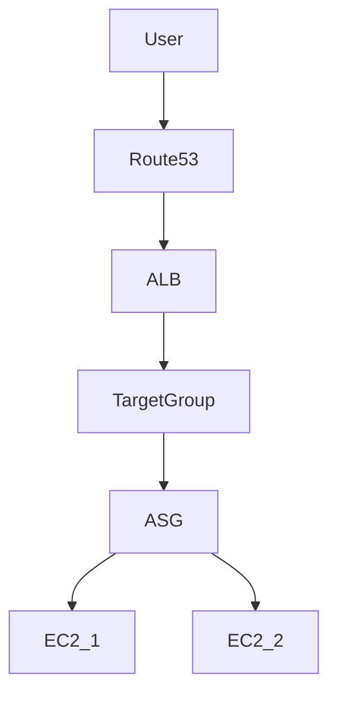
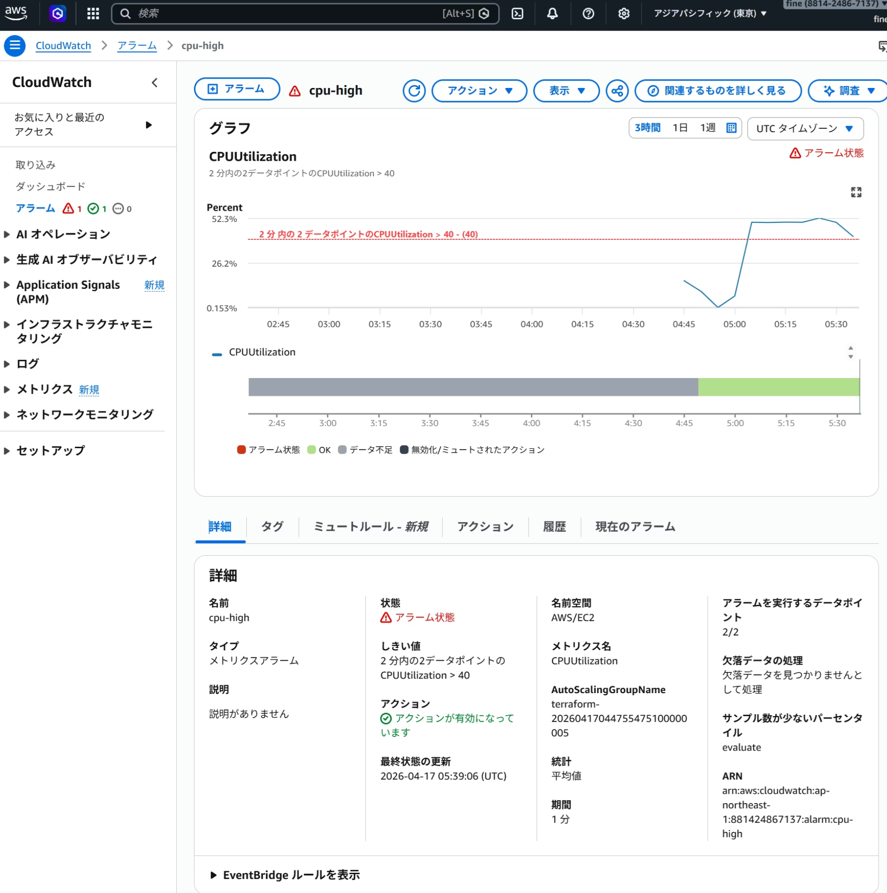
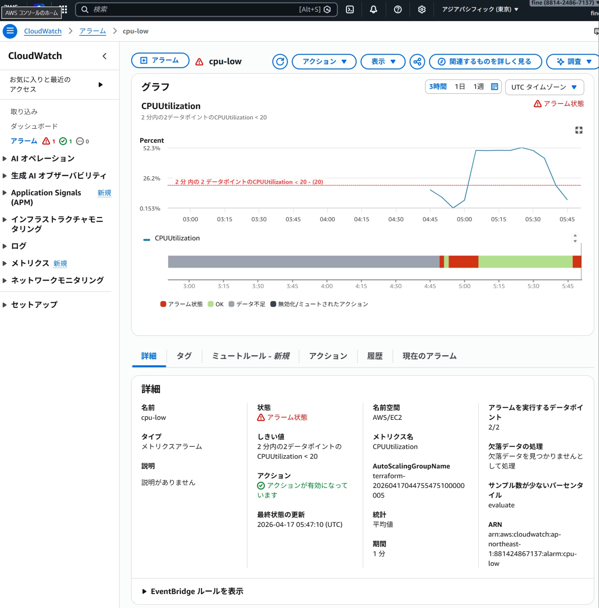

# 🌐 Terraform AWS Nginx + ALB + Auto Scaling

## 🧾 Summary

TerraformでAWSにスケーラブルなWebインフラ（ALB + Auto Scaling + Nginx）を構築し、  
負荷に応じてEC2が自動増減する環境を実装しました。

---

## 📌 概要

Terraformを用いて、AWS上にスケーラブルなWebインフラを構築しました。

本構成では、ALB（Application Load Balancer）とAuto Scalingを組み合わせることで、
トラフィックに応じてEC2インスタンスが自動で増減する仕組みを実現しています。

AWSの各サービスがどのように連携するかを実践的に理解できているのが良かったと思います。


---

## 🌍 Live Demo

👉 https://net-4.net

---

## 🏗 構成図



---

## ⚙️ 使用技術

* Terraform
* AWS

  * VPC
  * EC2
  * ALB
  * Auto Scaling
  * Route53
  * ACM
  * CloudWatch
* Nginx

---

## 🚀 機能

* HTTPS対応（ACM証明書）
* ALBによる負荷分散
* Auto Scalingによる自動スケール
* CloudWatchによるCPU監視
* Route53による独自ドメイン運用

---

## 🧠 設計意図

- 可用性向上のため、ALB + Auto Scaling構成を採用
- 単一障害点を排除するため、複数AZ構成を採用
- セキュリティ強化のため、EC2への直接アクセスを制限
- HTTPS化により通信の暗号化を実現
- Auto Scalingにより、トラフィック変動に対する耐障害性とコスト最適化を両立
- ALBを用いることで単一障害点を排除し、高可用性を確保

---

## 🚀 セットアップ手順

```bash
git clone https://github.com/tclinux/terraform-aws-nginx-alb
cd terraform-aws-nginx-alb

terraform init
terraform apply
```

---

## 🔄 Auto Scaling動作

### スケールアウト

* CPU使用率 > 40%
* EC2インスタンスが自動で増加
* CPU使用率が閾値を超えると、EC2インスタンスが自動で増加することを確認。



### スケールイン

* CPU使用率 < 20%
* EC2インスタンスが自動で削減
* CPU使用率が低下すると、EC2インスタンスが自動で削減されることを確認。


---

## 📊 成果

- CPU負荷に応じてEC2が自動スケールする環境を構築
- HTTPSでのWebアクセスを実現
- Terraformによる再現可能なインフラを構築

---

## 💡 工夫したポイント

* ALB経由のみアクセス可能なセキュリティ設計
* SSHアクセスを特定IPに制限
* モジュール化によるTerraformの再利用性向上
* HTTPS化によるセキュアな通信

---

## ⚠️ 苦労した点

* ALBとターゲットグループの連携
* CloudWatchアラームの閾値調整
* Auto Scalingが発火しない問題の切り分け
* セキュリティグループとSSH接続のトラブル

---

## 🧠 学び

AWS各サービス（ALB / Auto Scaling / CloudWatch）がどのように連携してスケーラブルな構成を実現するかを理解できた。

---

## 📈 今後の改善

* SSMを用いたSSHレス構成
* RDSを追加した3層アーキテクチャ
* ECSによるコンテナ化
* CI/CDパイプラインの構築

---

## 🧪 動作確認

* `https://net-4.net` にアクセスするとNginxが表示される
* 負荷をかけるとEC2インスタンスが増加
* 負荷を止めるとインスタンスが削減

---

## 📂 ディレクトリ構成

```
.
├── main.tf
├── backend.tf
├── modules/
│   ├── vpc/
│   ├── ec2/
│   ├── alb/
│   └── sg/
```

---


## 👤 作成者

* GitHub: https://github.com/tclinux
* Qiita: https://qiita.com/tclinux
