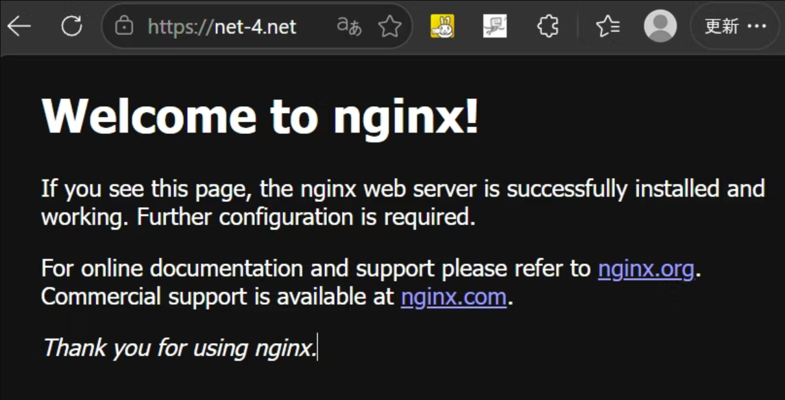

# Terraform AWS Nginx + ALB + HTTPS

## 📌 概要
Terraformを用いてAWS上に以下の構成を構築するプロジェクトです。

- VPC（自作）
- EC2（nginx自動構築）
- ALB（Application Load Balancer）
- HTTPS（ACM証明書）
- Route53（独自ドメイン）
- DNS自動更新（Terraform管理）

👉 `terraform destroy → apply` で完全復元可能な構成
---

## 🎯 目的

TerraformによるIaCの理解に加え、
実務で利用されるALB + HTTPS構成を再現することを目的として作成しました。


---

## 🌍 デモ

https://net-4.net
(普段はAWSの課金を防ぐために起動していません)


---

## 🏗 構成

* EC2 (nginx)
* ALB (Application Load Balancer)
* ACM (SSL証明書)
* Route53 (独自ドメイン)

---

## 📂 ディレクトリ構成

├── main.tf<br>
├── modules/<br>
│     ├── vpc/<br>
│     ├── sg/<br>
│     ├── ec2/<br>
│     └── alb/<br>
├── .gitignore<br>
└── README.md<br>

---

## 🌐 アーキテクチャ

Client<br>
↓<br>
Route53（DNS）<br>
↓<br>
ALB（HTTPS 443）<br>
↓<br>
EC2（nginx）

---

## ⚙️ 使用技術

- Terraform
- AWS
  - VPC
  - EC2
  - ALB
  - ACM
  - Route53
- nginx

---


## 🚀 セットアップ手順

### ① Terraform初期化

```bash
terraform init
```
### ② 実行
```
terraform apply
```

### ③ 削除
```
terraform destroy
```

---

## 🔐 セキュリティ

* EC2はALB経由のみアクセス可能
* HTTPS通信（ACM証明書）
* セキュリティグループで通信制御
* SSHは制限可能（IP指定）

---

## 💡 工夫した点

* Terraformのモジュール化（再利用性向上）
* ALB + HTTPS構成の自動化
* Route53をTerraformで管理しDNS自動更新を実現
* user_dataでnginxを自動構築

---

## ⚠️ 注意点

* ALBは再作成時にDNSが変わるため、Route53もTerraform管理必須
* 初回のみACMのDNS検証が必要

---

## 📚 学んだこと

* Terraformによるインフラ自動化（IaC）
* ALB + HTTPS構成
* AWSネットワーク設計（VPC / サブネット / SG）
* GitHubでの安全なコード管理

---

## 👤 作成者

* GitHub: https://github.com/tclinux
* Qiita: https://qiita.com/tclinux
