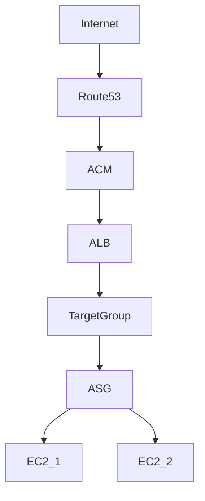
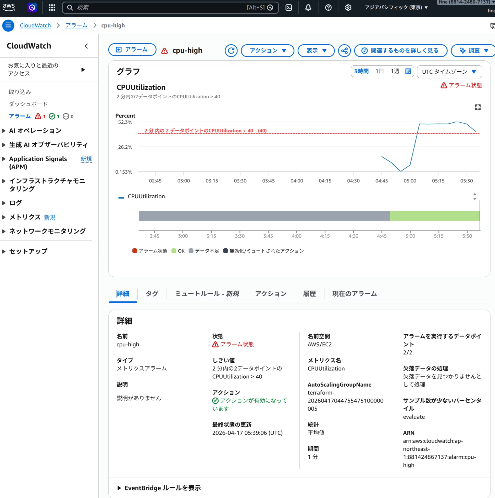
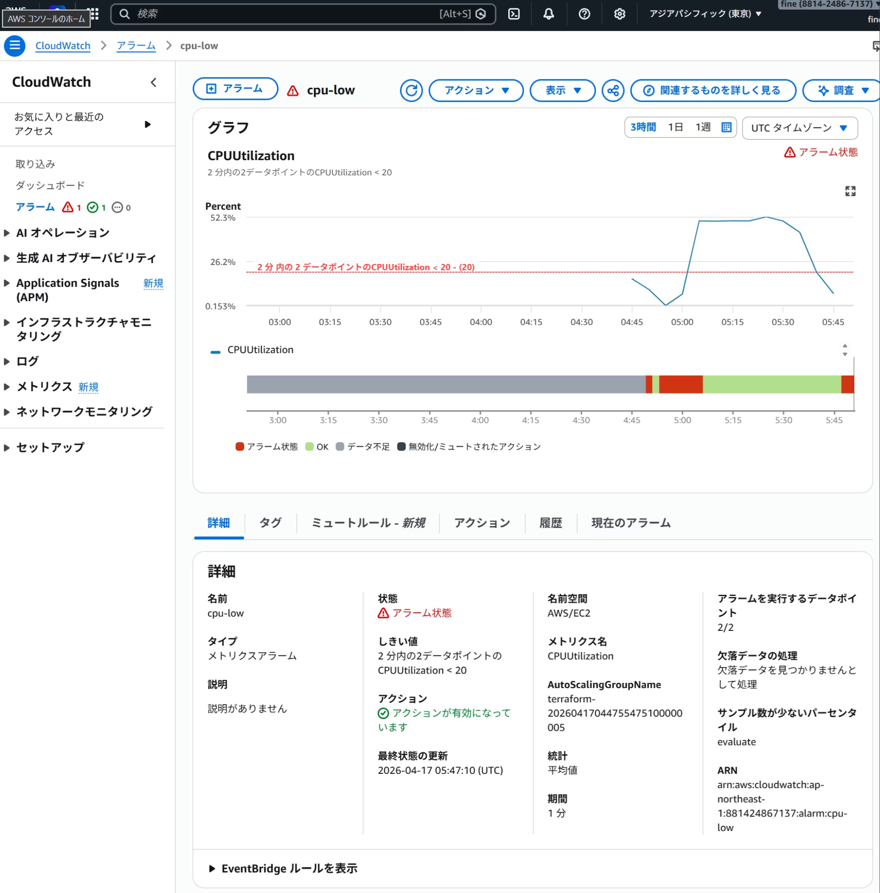

# 🌐 Terraform AWS Nginx + ALB + Auto Scaling

TerraformによるAWSインフラストラクチャ

本プロジェクトは、Terraformを使用して本番環境に近いAWSインフラストラクチャを構築・シミュレーションするために作成されました。

単にAWSリソースをプロビジョニングするだけでなく、実践的なAWS環境を通じて以下の要素に重点を置いています。

* Infrastructure as Code（IaC）
* 高可用性
* セキュリティ
* スケーラビリティ
* トラブルシューティング

---

## 🧾 Summary

TerraformでAWSにスケーラブルなWebインフラ（ALB + Auto Scaling + Nginx）に関して、負荷に応じてEC2が自動増減する環境を構築するだけでなく、ALBヘルスチェックやIAM権限、Security Groupなど実際に発生した問題を切り分け・改善しながら完成させました。 
。

---

## 📌 概要

Terraformを用いて、AWS上にスケーラブルなWebインフラを構築しました。

本構成では、ALB（Application Load Balancer）とAuto Scalingを組み合わせることで、
トラフィックに応じてEC2インスタンスが自動で増減する仕組みを実現しています。

AWSサービス間の依存関係や障害発生時の原因切り分けまで含めて実践的に検証しました。


---

## 🌍 Live Demo

👉 https://net-4.net (Amazon課金防止のため、普段は起動していません)

---

## 🏗 構成図


```mermaid
graph TD
    Internet--> Route53
    Route53 --> ACM
    ACM --> ALB
    ALB --> TargetGroup
    TargetGroup --> ASG
    ASG --> EC2_1
    ASG --> EC2_2
```

---

## ⚙️ 使用技術

| Technology | Purpose |
| --- | --- |
| Terraform | IaC |
| ALB | Load Balancing |
| Auto Scaling | High Availability |
| CloudWatch | Monitoring |
| ACM | HTTPS |
| SSM | Secure Operation |

---

## 🚀 機能

* HTTPS対応（ACM証明書）
* ALBによる負荷分散
* Auto Scalingによる自動スケール
* CloudWatchによるCPU監視
* Route53による独自ドメイン運用

---

## 🧠 設計意図

- 可用性向上のため、ALB + Auto Scaling構成を採用
- 単一障害点を排除するため、複数AZ構成を採用
- セキュリティ強化のため、EC2への直接アクセスを制限
- HTTPS化により通信の暗号化を実現
- Auto Scalingにより、トラフィック変動に対する耐障害性とコスト最適化を両立
- Terraform Moduleを採用し、保守性・再利用性を向上

---

## 🚀 セットアップ手順

```bash
git clone https://github.com/tclinux/terraform-aws-nginx-alb
cd terraform-aws-nginx-alb

terraform init
terraform apply
```

---

## 🔄 Auto Scaling動作

### スケールアウト

* CPU使用率 > 40%
* EC2インスタンスが自動で増加
* CPU使用率が閾値を超えると、EC2インスタンスが自動で増加することを確認。



### スケールイン

* CPU使用率 < 20%
* EC2インスタンスが自動で削減
* CPU使用率が低下すると、EC2インスタンスが自動で削減されることを確認。


---

## 📊 成果

- CPU負荷に応じてEC2が自動スケールする環境を構築
- HTTPSでのWebアクセスを実現
- Terraformによる再現可能なインフラを構築

---

## 🔐 セキュリティ対策（SSM）

SSHを使用せず、AWS Systems Manager Session Managerを利用してEC2に接続。

- ポート22を閉鎖
- キーペア不要
- IAMロールによるアクセス制御

これにより、セキュリティリスクを低減した構成を実現。

---

## 💡 工夫したポイント

* ALB経由のみアクセス可能なセキュリティ設計
* SSHアクセスを特定IPに制限
* モジュール化によるTerraformの再利用性向上
* HTTPS化によるセキュアな通信

---

## ⚠️ 苦労した点

* ALBとターゲットグループの連携
* CloudWatchアラームの閾値調整
* Auto Scalingが発火しない問題の切り分け
* セキュリティグループとSSH接続のトラブル

---

## 🧠 学び

AWS各サービス（ALB / Auto Scaling / CloudWatch）がどのように連携してスケーラブルな構成を実現するかを理解できた。

---

## 📈 今後の改善

* SSMを用いたSSHレス構成
* RDSを追加した3層アーキテクチャ
* ECSによるコンテナ化
* CI/CDパイプラインの構築

---

## 🧪 動作確認

* `https://net-4.net` にアクセスするとNginxが表示される
* 負荷をかけるとEC2インスタンスが増加
* 負荷を止めるとインスタンスが削減

---

## 📂 ディレクトリ構成

```
.
├── main.tf
├── backend.tf
├── modules/
│   ├── vpc/
│   ├── ec2/
│   ├── alb/
│   └── sg/
```

---


## 👤 作成者

* GitHub: https://github.com/tclinux
* 構築手順の詳細はこちら  
* Qiita: https://qiita.com/tclinux
